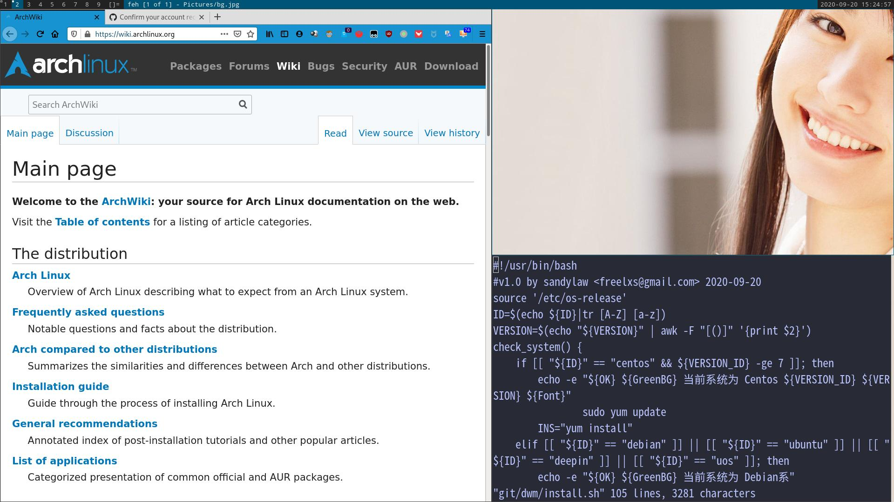

# My dwm Setup

## Description

[dwm](https://dwm.suckless.org/) is a dynamic window manager for X. It manages windows in tiled, monocle and floating layouts. All of the layouts can be applied dynamically, optimising the environment for the application in use and the task performed.

## Install

`wget -N --no-check-certificate -q -O install.sh "https://raw.githubusercontent.com/sandylaw/dwm/master/install.sh" && chmod +x install.sh && bash install.sh` 

## Default Setting

- Use Window-key instead of Alt (for my keyboard)
- Win+SPACE as dmenucmd (default Alt-p)
- Alt+Tab as switch between open applications (default Alt-j)
- Alt+F4 as kill current application (default Alt-Shift-c)
- Default browser: firefox ; Win+w
- Default filemanager: pcmanfm ; Win+Shift+f
- Default terminal: st ; Win+Shift+Enter
- Resart dwm: Win+Shift+q; will not logout.

- Start record: Ctrl+Alt+r
- Pause record: Ctrl+Alt+p
- Stop  recore: Ctrl+Alt+s

- PrintScreen All   :  Printscreen
- Focuse PrintScreen:  Shift+Printscreen
- Select PrintScreen:  Ctrl +Printscreen
- Killclient: Win+Shift+c

- raise volume by each 10 % : Alt+F10
- reduce volume by each 10 %: Alt+F9
- mute/unmute audio :         Alt+F8

## st

- Pageup/pagedown: shift+pageup/pagedown or mouse

## Layouts

There are three layouts available by default: the tiling layout, the monocle layout, and the floating layout.

- tiling layout:organizes windows into two main areas: master on the left, and stack on the right. You can activate the tiling layout by pressing Win+t.

To swap windows between the two areas, hover your mouse over one in the stack area and press Win+Enter to swap it with the one in the master area.

- The monocle layout: makes your primary window take the whole screen. You can switch to it by pressing Win+m.

- the floating layout lets you move and resize your windows freely. The shortcut for it is Alt+f.

## Workspaces and tags

Each window is assigned to a tag (1-9) listed at the top bar. To view a specific tag, either click on its number using your mouse or press Win+1..9. You can even view multiple tags at once by clicking on their number using the secondary mouse button.

Windows can be moved between different tags by highlighting them using your mouse, and pressing Win+Shift+1..9. 
